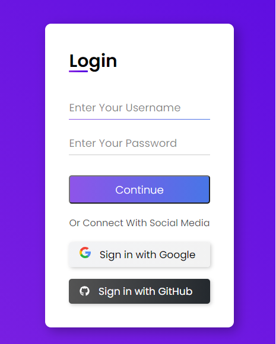

<h1>
  Formulário de login
</h1>

Esse mini projeto feito com HTML e CSS foi baseado no tutorial ensinado pela <a href="https://www.linkedin.com/in/giovannamoeller/" target="_blank">Giovanna Moeller</a>.

Vocês podem conhecer um pouco melhor os projetos dela acessando os links abaixo:
<ul>
<li>
<a href="https://github.com/giovannamoeller/login-form-1" target="_blank">Git Hub </a>
</li>
<li>
<a href="https://www.instagram.com/girl.coding/" target="_blank">Instagram </a>
</li>
<li>
<a href="https://www.youtube.com/watch?v=MkXuQ9CcHqU" target="_blank">YouTube </a>
</li>
</ul>

# O Projeto:

A seguir está disponibilizado o resultado final deste projeto.

Este é um projeto totalmente focado para o front-end de uma aplicação. Os conceitos aplicados, apesar de serem simples, me deram bastante norte principalmente a respeito das pseudoclasses `after` e `before` do CSS.

Além disso, podemos fazer algumas transições com essas pseudoclasses que deixaram o formulário com um toque especial de estilização.

Por fim, ressalto que é um projeto super gostoso de se fazer, pelo qual podemos consolidar os conhecimentos básicos de CSS, bem como inicializar nos conceitos intermediários a respeito da ferramenta.

# Desenvolvimento:
<h3>
Este projeto foi desenvolvido utilizando:
</h3>

<ul>
<li> HTML 5
</li>
<li> CSS 3
</li>
</ul>

Projeto idealizado por<strong> Giovanna Moeller</strong>.

 

 

Projeto desenvolvido por <strong>Milton Soares</strong>.

